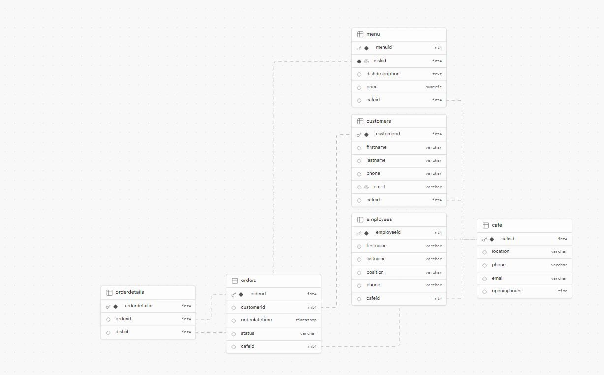
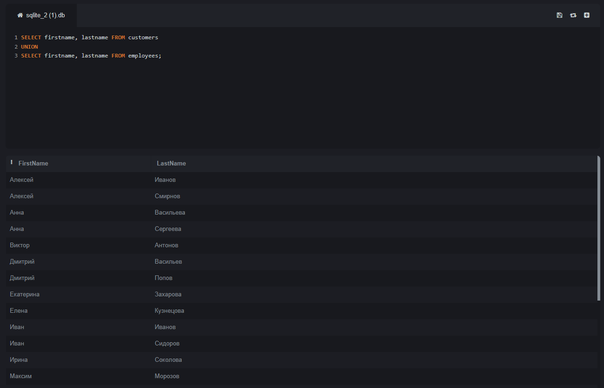
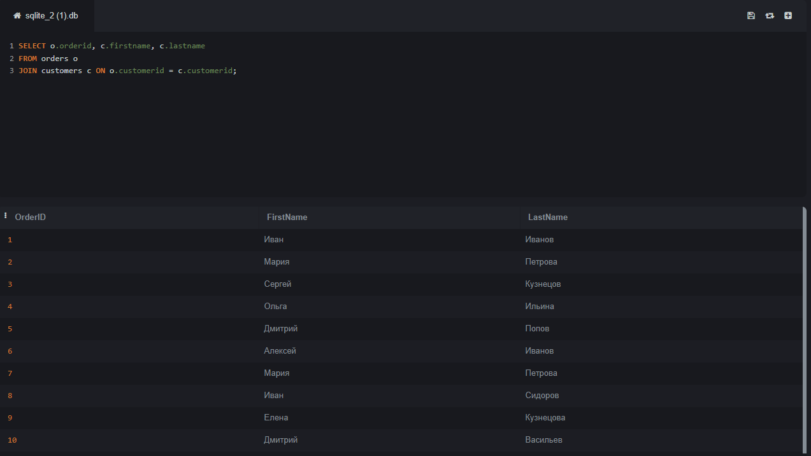
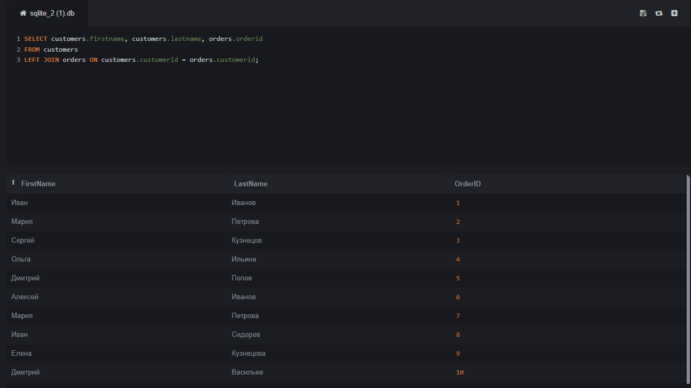
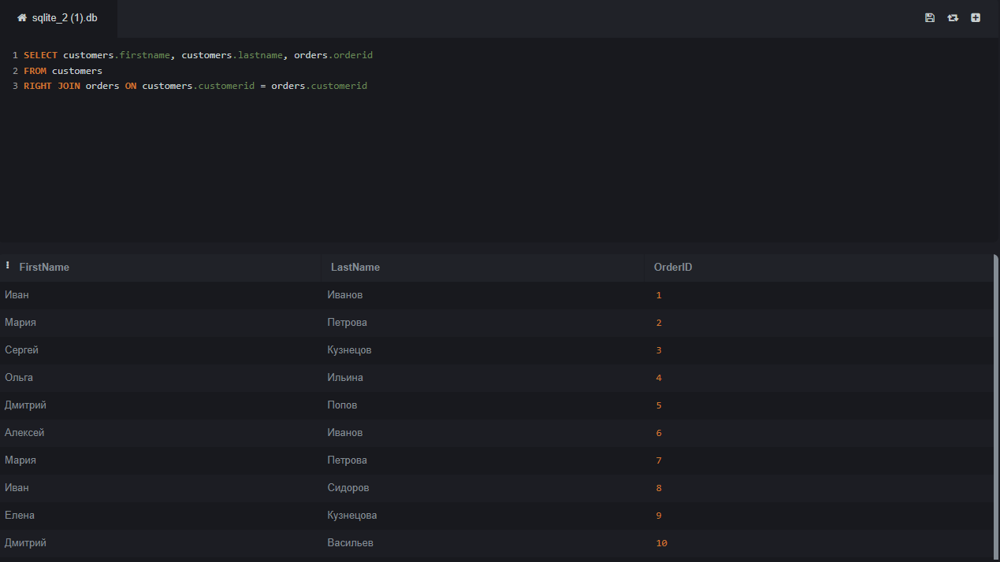
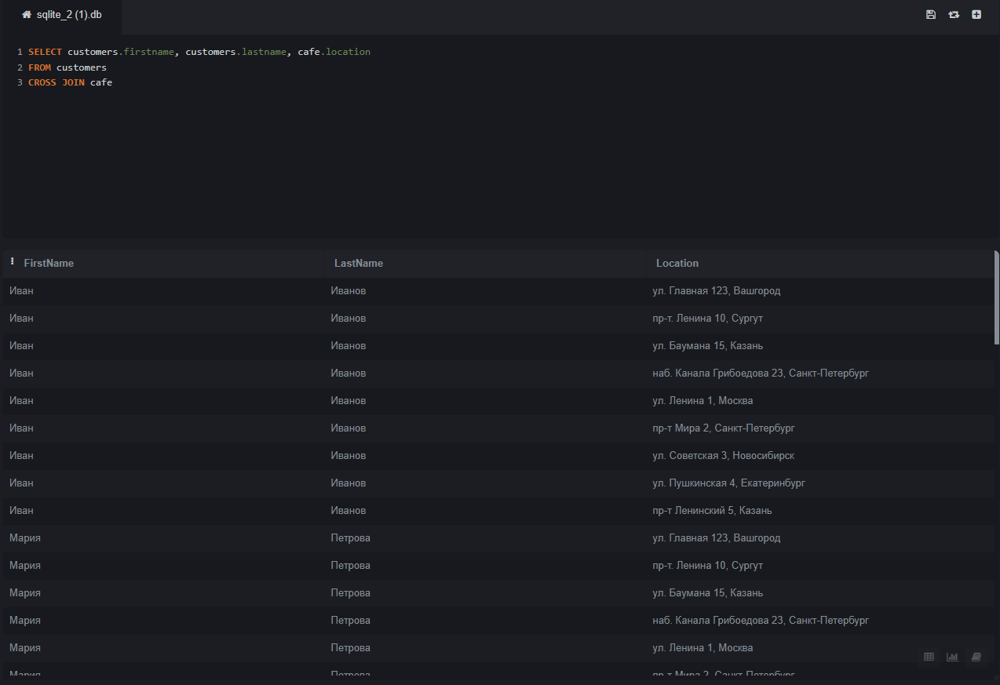
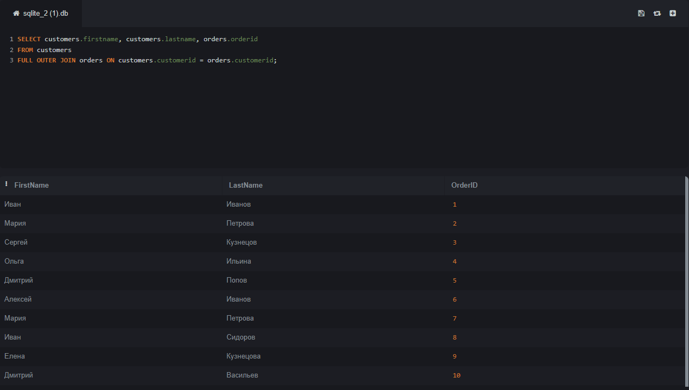

# Работа по базам данных

## Содержание
- [ER-диаграмма](#er-диаграмма)
- [Описание базы данных](#описание-базы-данных)
- [Демонстрация SQL-запросов](#демонстрация-sql-запросов)

## ER-диаграмма


## Описание базы данных
### Описание сущностей
#### Сущность "menu"
- menuid: int - Уникальный идентификатор записи в меню.
- dishid: int - Идентификатор блюда, внешний ключ.
- dishdescription: text - Подробное описание блюда.
- price: numeric - Цена блюда.
- cafeid: int - Идентификатор кафе, к которому принадлежит меню, внешний ключ.

#### Сущность "customers"
- customerid: int - Уникальный идентификатор клиента.
- firstname: varchar - Имя клиента.
- lastname: varchar - Фамилия клиента.
- phone: varchar - Телефонный номер клиента.
- email: varchar - Электронная почта клиента.
- cafeid: int - Идентификатор кафе, которое клиент посещает, внешний ключ.

#### Сущность "employees"
- employeeid: int - Уникальный идентификатор сотрудника.
- firstname: varchar - Имя сотрудника.
- lastname: varchar - Фамилия сотрудника.
- position: varchar - Должность сотрудника в кафе.
- phone: varchar - Телефонный номер сотрудника.
- cafeid: int - Идентификатор кафе, в котором работает сотрудник, внешний ключ.

#### Сущность "cafe"
- cafeid: int - Уникальный идентификатор кафе.
- location: varchar - Адрес расположения кафе.
- phone: varchar - Телефонный номер кафе.
- email: varchar - Электронная почта кафе.
- openinghours: time - Часы работы кафе.

#### Сущность "orders"
- orderid: int - Уникальный идентификатор заказа.
- customerid: int - Идентификатор клиента, сделавшего заказ, внешний ключ.
- orderdatetime: timestamp - Дата и время совершения заказа.
- status: varchar - Статус заказа.
- cafeid: int - Идентификатор кафе, в котором сделан заказ, внешний ключ.

#### Сущность "orderdetails"
- orderdetailid: int - Уникальный идентификатор детали заказа.
- orderid: int - Идентификатор заказа, внешний ключ.
- dishid: int - Идентификатор блюда в заказе, внешний ключ.

### Ограничения и связи

#### Связи между menu и cafe
- ForeignKey (cafeid в menu): menu связана с cafe через cafeid, что означает, что каждая запись в menu соответствует определенному кафе.

#### Связи между customers и cafe
- ForeignKey (cafeid в customers): customers связана с cafe через cafeid, указывая на кафе, которое клиент посещает.

#### Связи между employees и cafe
- ForeignKey (cafeid в employees): employees связана с cafe через cafeid, что подразумевает, что каждый сотрудник работает в определенном кафе.

#### Связи между orders, customers, и cafe
- ForeignKey (customerid в orders): orders связана с customers через customerid, что позволяет отследить, какой клиент сделал заказ.
- ForeignKey (cafeid в orders): orders также связана с cafe через cafeid, что указывает на кафе, в котором был сделан заказ.

#### Связи между orderdetails, orders, и menu
- ForeignKey (orderid в orderdetails): orderdetails связана с orders через orderid, что позволяет определить, к какому заказу относятся детали заказа.
- ForeignKey (dishid в orderdetails): orderdetails связана с menu через dishid, что позволяет определить, какие блюда включены в заказ.

Эти связи обычно реализуются через внешние ключи в реляционной базе данных, чтобы обеспечить целостность данных и легко соединять связанные таблицы при запросах.


## Демонстрация SQL-запросов
### UNION
Для объединения результатов двух запросов, которые имеют одинаковое количество столбцов и совместимые типы данных, используется оператор `UNION`. Например:

```sql
SELECT firstname, lastname FROM customers
UNION
SELECT firstname, lastname FROM employees;
```

Этот запрос вернет список уникальных имен и фамилий клиентов и сотрудников.

...

### JOINs
Для демонстрации работы `JOIN` можно использовать следующий запрос, который соединяет информацию о заказах с информацией о клиентах:

```sql
SELECT o.orderid, c.firstname, c.lastname
FROM orders o
JOIN customers c ON o.customerid = c.customerid;
```

Этот запрос возвращает идентификаторы заказов вместе с именами и фамилиями клиентов, которые их сделали.

### LEFT JOIN
Использование `LEFT JOIN` для получения всех клиентов и их заказов, включая клиентов, у которых нет заказов.

```sql
SELECT customers.firstname, customers.lastname, orders.orderid
FROM customers
LEFT JOIN orders ON customers.customerid = orders.customerid;
```

### RIGHT JOIN
Использование `RIGHT JOIN` для получения всех заказов и информации о клиентах, включая заказы, не связанные с клиентами.

```sql
SELECT customers.firstname, customers.lastname, orders.orderid
FROM customers
RIGHT JOIN orders ON customers.customerid = orders.customerid;
```

### CROSS JOIN
`CROSS JOIN` создаёт декартово произведение, т.е., соединяет каждую запись из одной таблицы с каждой записью из другой таблицы.

```sql
SELECT customers.firstname, customers.lastname, cafe.location
FROM customers
CROSS JOIN cafe;
```

### FULL OUTER JOIN
`FULL OUTER JOIN` используется для выборки всех записей, когда есть совпадение в одной из таблиц, включает всех клиентов и все заказы, даже если нет совпадения.

```sql
SELECT customers.firstname, customers.lastname, orders.orderid
FROM customers
FULL OUTER JOIN orders ON customers.customerid = orders.customerid;
```

...
### Оконные функции
Оконные функции позволяют выполнять вычисления над набором строк, подобно агрегатным функциям, но без группировки. Например:

```sql
SELECT orderid, orderdatetime, SUM(price) OVER (PARTITION BY customerid) as total_spent
FROM orders;
```
Этот запрос рассчитывает общую сумму, потраченную каждым клиентом.

...

### CASE
Оператор `CASE` используется для реализации логики ветвления в SQL. Например:

```sql
SELECT orderid, 
       CASE 
           WHEN status = 'Shipped' THEN 'Отправлен'
           WHEN status = 'Cancelled' THEN 'Отменен'
           ELSE 'В обработке'
       END as status_description
FROM orders;
```
Этот запрос возвращает идентификаторы заказов с описанием их статуса на русском языке.

...

### Работа с текстовыми данными
Функции для работы с текстовыми данными в SQL позволяют манипулировать строками. Например, функция `CONCAT` объединяет строки:

```sql
SELECT CONCAT(firstname, ' ', lastname) as fullname
FROM customers;
```
Этот запрос возвращает полные имена клиентов.

...
